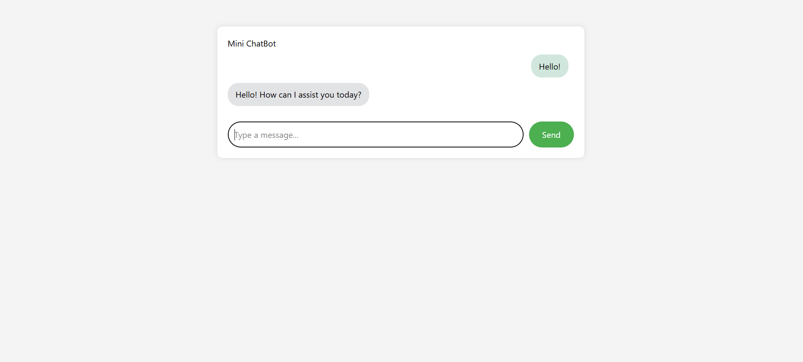

# ChatBot-mini

A Laravel-based mini chatbot web application that simulates human-like conversations. Built as a personal project to explore Laravel, Blade, and backend interaction flows.

  

## 🔥 Features

- Clean, responsive UI using Blade templates
- Laravel backend with session-based conversation logic
- Easily extendable to integrate OpenAI/LLM APIs in the future
- Good folder structure following MVC principles

## 🚀 Technologies Used

- Laravel 10
- PHP 8.3
- Blade Templating Engine
- Bootstrap (optional)
- MySQL or PostgreSQL

## ⚙️ Setup Instructions

> These steps are for anyone who wants to clone and run this project locally:

1. Clone the repository:
   git clone https://github.com/snekasuresh/ChatBot-mini-v2.git
   cd ChatBot-mini-v2

2. Install PHP dependencies:
   composer install

3. Copy and configure the .env file:
   cp .env.example .env
   php artisan key:generate

4. (Optional) Run database migrations:
   php artisan migrate

5. Start the Laravel development server:
   php artisan serve

## 📸 Screenshots

Here’s a preview of the chatbot interface:

## 🙋‍♀️ Author

**Sneka Suresh**  
💼 Aspiring Full-Stack Developer  
🔗 GitHub: https://github.com/snekasuresh

## 🛡️ License

This project is private and owned by the author. Not open for public reuse or distribution.

